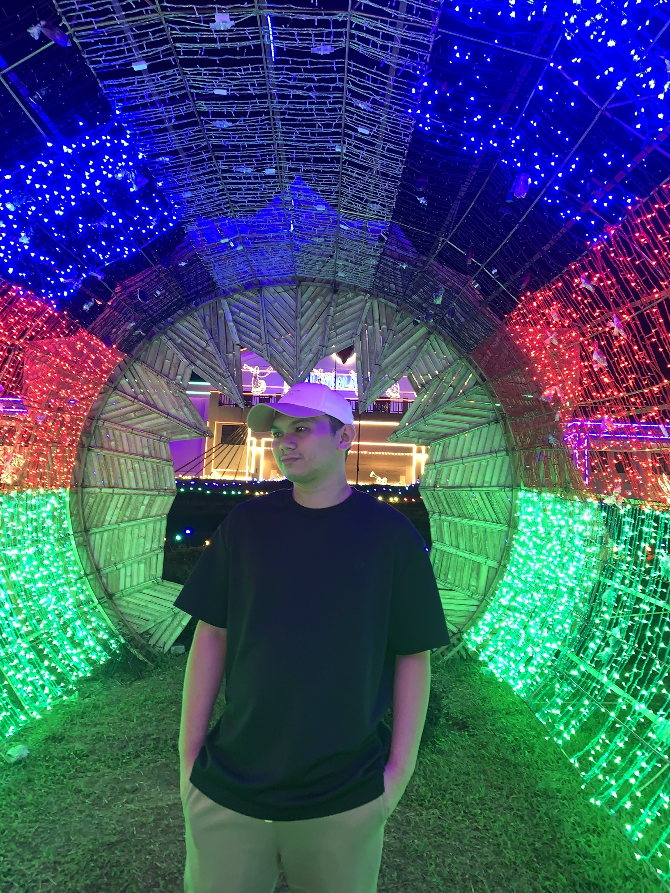

<table width="100%">
  <tr>
    <td width="180" align="center" valign="middle">
      
    </td>
    <td valign="middle">
      <h1>Lloyd</h1>
      
<b>Developer • UI/UX • Automation Systems</b>

      
Building practical and real-world solutions through code.

    </td>
  </tr>
</table>

---

## Interests
- Developing real-world solutions
- Automation systems

---

## Technologies I Use

  

---

## Featured Projects
- EMS Patient Care Reporting System
- Training and Logistics Division Inventory Management System
- Vehicle Fuel Tracking System

---

## GitHub Stats

  
  

